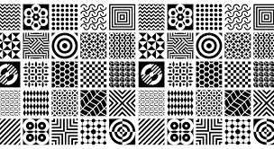

In a Computer Science interview, you might be asked about design patterns. Following that, you could be questioned about the design patterns you've used in your own code. Your responses to these questions can reveal the strength of your coding habits and areas that may need improvement. Being able to explain design patterns and share examples from your coding experiences shows your knowledge and ability to apply industry best practices. It also indicates your awareness of coding standards. These questions assess your coding skills and give insights into the robustness of your coding habits.
## Coding Style
It's important to recognize that everyone has their own coding style, and online opinions may not always align with yours. The only entity that should dictate your code style is your employer, especially in a team setting. Beyond that, feel free to embrace your unique coding approach and do what works best for you.
## Design Patterns

Explaining design patterns is best done by highlighting their function. A design pattern allows others to easily understand your code without delving too deeply into it, as long as they are aware that you're using the pattern. Adhering to a design pattern results in readable, scalable, and consistent code, making it more enjoyable to work with compared to scattered and messy code. Design patterns can vary in complexity based on your needs.
For instance, one design pattern involves defining a method in a parent class, requiring all inheriting classes to incorporate that method. In practical terms, if you have various shapes and need to perform area calculations, you could create a square and circle class that inherits from a shape class, which mandates an area method. This ensures that calling circle.area() and square.area() will consistently work.
The next question, about personal design patterns, can be nuanced. In my code, I employ error handling by value as a design pattern. I prefer this over throwing errors because it provides clarity about when an error might occur. Documenting error return values allows for straightforward handling using a switch or if statements. Another pattern I use is the separation of concerns, dividing tasks into different functions. This could extend to a complete separation of frontend and backend, a common practice in workplaces. I've applied this pattern in C and C++ projects during my university course in Program Structure. While I consider these design patterns, interpretations may vary.
Regardless of the design patterns you choose, it's crucial to understand why you use them and be open to considering other patterns. Exposure to various design philosophies helps you adapt to preferences of potential employers. Imagine being asked about design patterns in an interview and having a variety to discuss effortlessly. Ultimately, this approach not only enhances your coding skills but also allows you to adapt patterns to suit specific project requirements.

