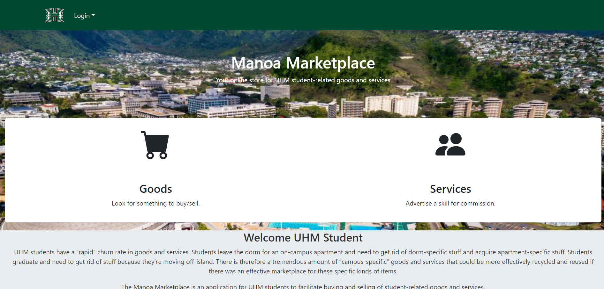

  

## Introduction

Manoa MarketPlace is the project in UH Manoa, I was working with 4 groupmate, Andrew Lin, Yujie He, BingYing Li, Carlton Hung. The main purpose of the app is to provide an efficient marketplace to help UHM students recycle and reuse a large number of "campus specific" goods and services more efficiently, buying and selling goods and services they do not need.

In this Web application, I am responsible for implementing main page, https in webpage. 

## Conclusion
Developing my first web application and collaborating with others provided valuable insights into GitHub usage and various React features, including photo uploading and storage functionalities.  The main page and https technology not only deepened my understanding of React and web development but also allowed me to experience effective communication and collaboration within a team of web developers.  This hands-on project enriched my skills, offering a practical perspective on the collaborative nature of web development and the utilization of key tools and features.
