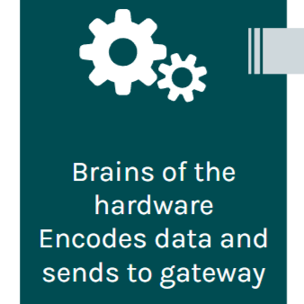

 In this semester the Firmware Team has a lot of challenges and opportunities to learn more in firmware and assistance. There are many tasks to do even if we only finish a few tasks in this semester. We tried to learn software and led new members to understand the basic information and how to apply. In this period, we got a lot of assistance with Kenny. If we did not understand some problems and stuck to it and could not go forward. We spent an amount of time on assisting the hardware teams. We would be able to provide support for Apple and Guava team. They could send data to the gateway when testing their current weatherboxes and update code on GitHub. We found that ‘Node-65535.csv’ file will store all hardware teams testing. Both Apple and Guava data will be stored in the .csv file unless it is renamed.  As that simplified data pipeline, we needed to create postgresql user on the raspberry pi, database in new user, a table for the weatherboxes. The gateway computer is down this semester, hopefully the new one will come and continue working on testing gateway. 
            In the Firmware Team, we learn how to work together, look for the knowledge that we do not understand and consult with SCEL members. They always use their time and help us step by step in complicated information. We have the responsibility to fix problems in hardware team. We would like to have a thank you to Kenny, Thomas, and Josh. Without them, we could not accomplish the tasks in this semester. We have a good experience in Firmware Team, hope SCEL and Firmware Team will achieve their goals in the future.
